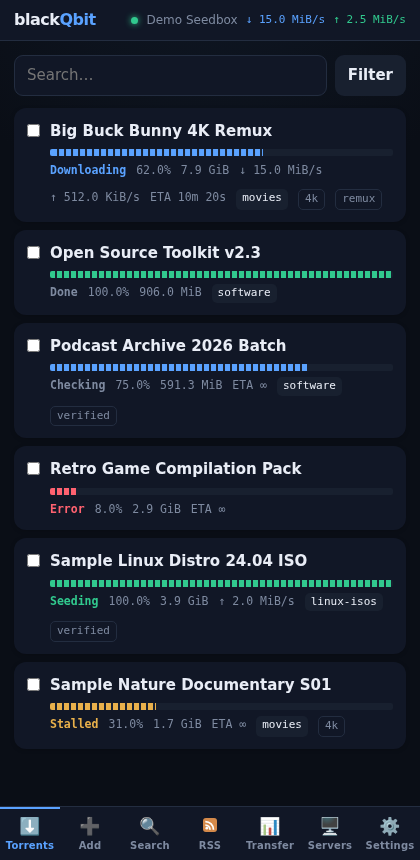
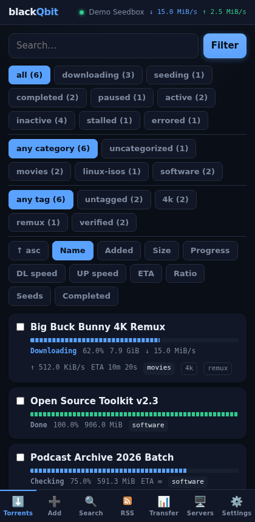
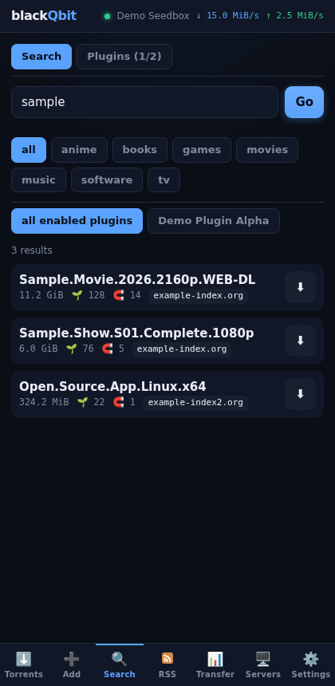
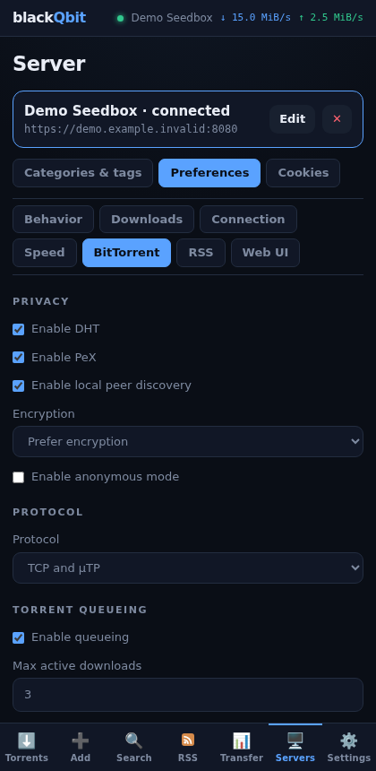
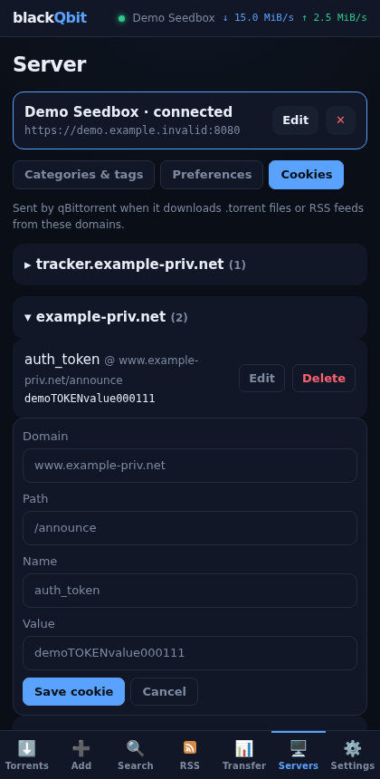
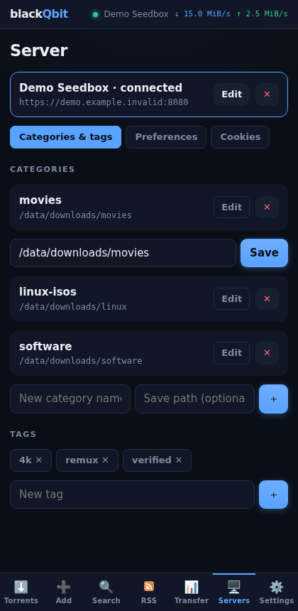
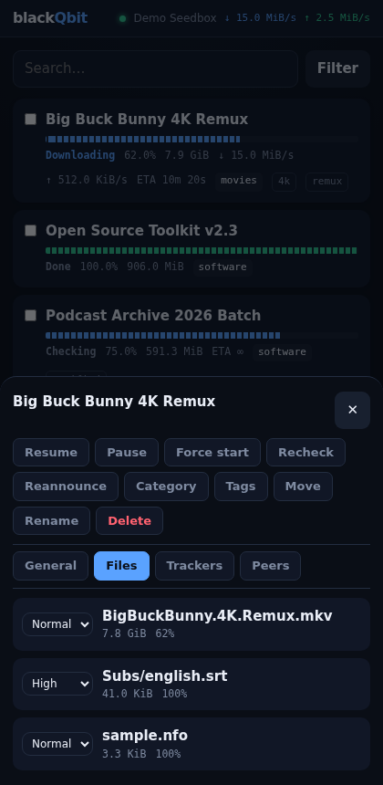
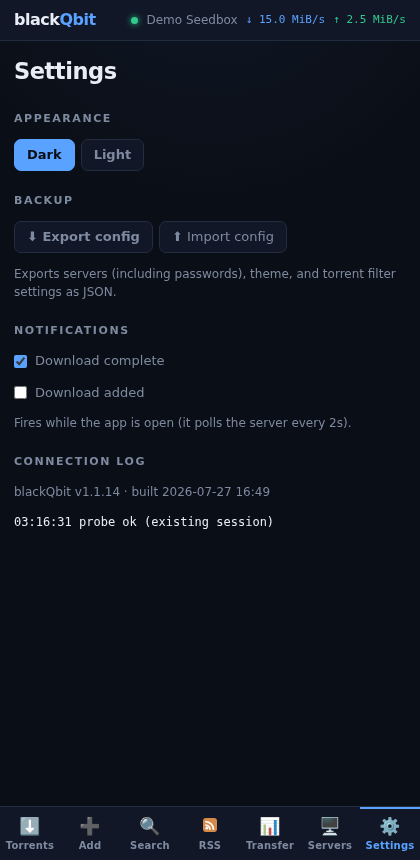

# Introduction 

A new Qbittorrent client for Android

This client was originally made for me, but I thought I'd share. It was vibe coded so hate away

The older android clients weren't doing it for me and I needed access to all the v4 and v5 API calls from qBit so I made this

I'm just sharing with the community, please no hate ❤️

https://github.com/UnkyBadTouch/blackQbit

# blackQbit

A mobile-first qBittorrent remote client. React + Vite, shipped as an Android APK via Capacitor. Dark by default, no account, no cloud — it just talks straight to your own qBittorrent WebUI.

*Screenshots below use synthetic demo data — no real server, torrents, or credentials.*

## Screenshots

| | |
|---|---|
|  |  |
| Torrents — segmented progress bars colored by state, category/tag badges | Filters — live counts per status/category/tag, hidden when zero |
|  |  |
| Search — plugin-backed search with a result count | Preferences — full qBittorrent v5 WebUI-style tabs |
|  |  |
| Cookies — grouped by domain (`www.`/bare/`.`-prefixed treated as one site), inline edit | Categories & tags — inline edit under the row being changed |
|  |  |
| Torrent detail — actions, file priorities, safe-area-aware bottom sheet | Settings — theme, config export/import, notifications |

## Features

- Torrent list with search, sort, and filters (status/category/tag) showing live counts
- Add via magnet link or `.torrent` file
- Full torrent detail: files (priority), trackers, peers, general info
- Search tab: qBittorrent's plugin search, with install/enable/uninstall plugin management
- RSS feeds and auto-download rules
- Global transfer stats and speed limits (including alternative/scheduled limits)
- Categories, tags, and cookies (grouped by domain) management
- Full preferences editor, tabbed to match qBittorrent's own WebUI (Behavior, Downloads, Connection, Speed, BitTorrent, RSS, Web UI)
- Background notifications for added/completed downloads, kept alive via a foreground service
- Config export/import (servers, theme, filters) as JSON, via the native share sheet
- Light/dark theme

## Install

Grab the latest APK from [Releases](../../releases). Sideloading requires enabling "install unknown apps" for whichever app you open it with.

## Requirements

- qBittorrent WebUI enabled, reachable from your phone
- qBittorrent ≥ 5.1 for the cookie manager (older versions can't expose the API it needs)

## Building from source

```sh
npm install
CAP_BUILD=1 npm run build && npx cap sync android
cd android && ./gradlew assembleDebug
```

Output: `android/app/build/outputs/apk/debug/app-debug.apk`.

Browser/dev use: `npm run dev` (Vite) or `node server.js <port>` (serves `dist/` plus a same-origin proxy for servers that would otherwise hit CORS).
